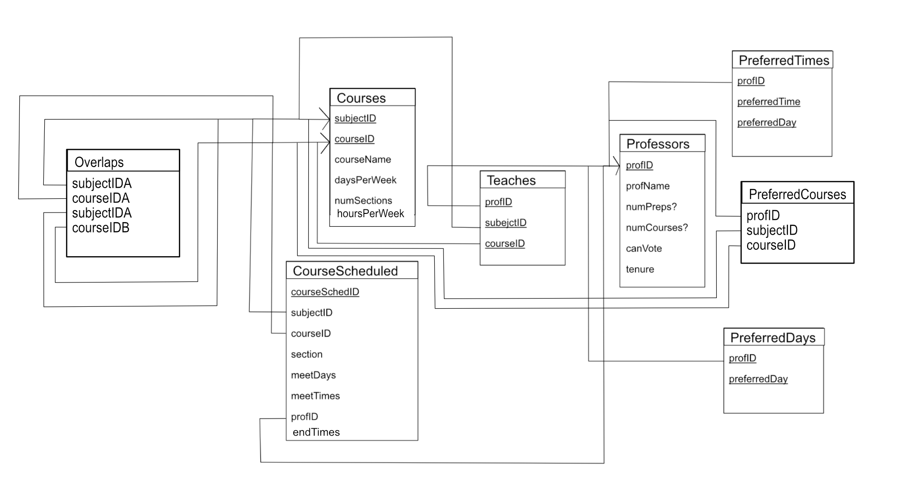

# Course Scheduler for the Hispanic Studies Department

Collaborated with two peers to create a databases solution to a course scheduling problem for the University of Puget Sound Hispanic Studies Department. 

With dozens of courses to choose from, from general intro classes to niche upper-level courses, and a variety of teaching specialties and scheduling requirements, creating a department course schedule for each semester is a non-trivial task. To optimize this process, we developed a database solution that produces optimal schedules based on several ranking systems using professors' time and teaching preferences) Given a set of courses to be taught this semester (see CourseTemplate.xlsx) and a set of professor abilities and preferences (see ProfessorTemplate.xlsx), we populate a database (see schema below) using a relational model implemented in SQLite, and run an algorithm we wrote to generate optimal course schedules. We built a website interface for simple user interaction with the database. 

Our database schema:

